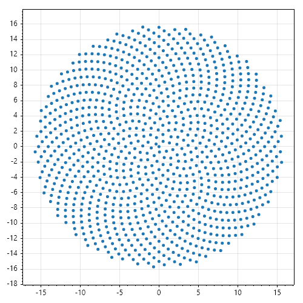
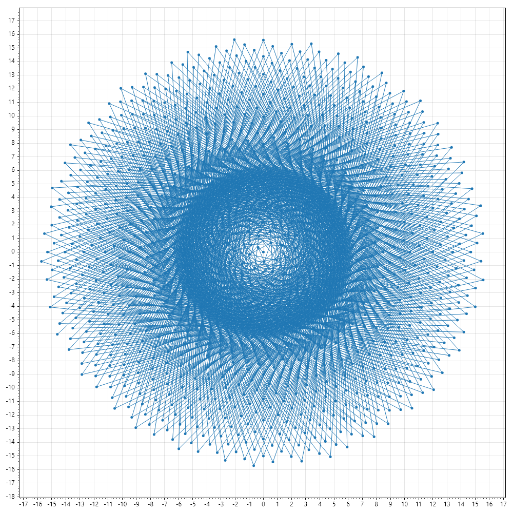

# PhyllotaxisDistribution

Distribution of positions radially around a central axis in a spiral pattern. Phyllotaxis is a mathematical idealization of patterns of repeated
plant elements, like leaves or petals. The golden ratio, $\varphi$, is used to calculate the distribution:

$$
\varphi = \frac{1 + \sqrt{5}}{5} \approx 1.618033988749894...
$$

$$
\frac{360\degree}{\varphi + 1} \approx 137.5\degree
$$

This distribution is not random, the algorithm generates the position of each point by turning a golden ratio of the turn and taking the direction with a certain separation.

  

  

